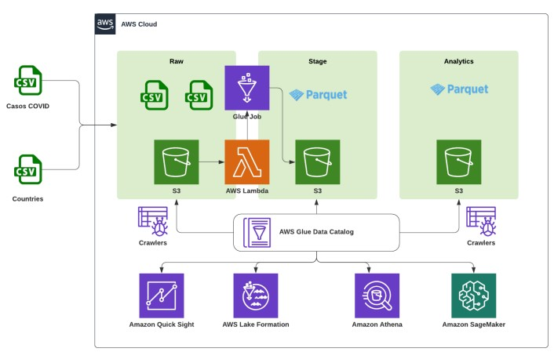
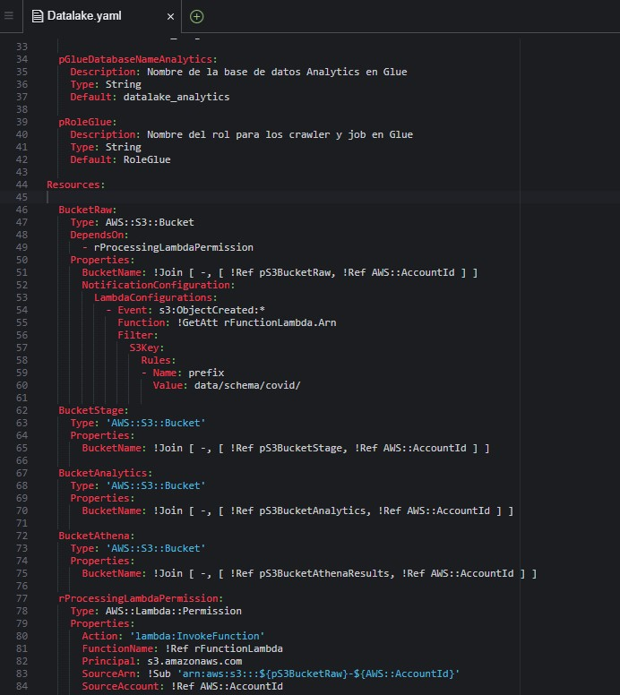
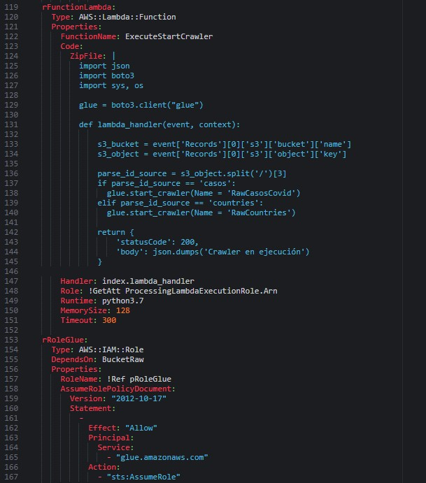

# Data-processing-COVID-cases-GLUE-AWS

En este proyecto se hara el procesamiento de datos por capas de casos de COVID por paises, se tiene archivos .csv de casos y countries que se ingestaran en la capa RAW de un bucket de S3 activando el trigger para ejecutar la funcion lambda y crear las tablas logicas "casos" y "countries" en Glue Data Catalog mediante los CRAWLER creados. Seguidamente mediante un JOB creado en Glue Studio se procedera a enviar las tablas de "casos" y "countries" a la capa STAGE en formato PARQUET, posteriormente con ATHENA se procedera a realizar transformaciones para crear un solo TABLON de las 2 tablas de las variables de interes llamado "casos_countries" y se enviara a la capa ANALYTICS para su posterior analisis, para la creacion de dashboards e identificar insights de valor.

## Arquitectura realizada

  

##  PROCEDIMIENTO

## Creacion de recursos con CLOUDFORMATION con la plantilla YAML

 - Se procede a crear los buckets para las capas RAW, STAGE, ANALYTICS, así como un 4to bucket para guardar los logs de Athena.
 - Se crea las bases de datos RAW,STAGE,ANALYTICS en GLUE
 - Se crea tambien el rol para que el Crawler de GLUE pueda tener acceso a los servicios
 - Tambien se le da permisos para invocar funciones lambda en el bucket raw donde se almacenará la informacion primero. Para transformar la informacion de formato .csv    a formato parquet.   Tambien se coloca el rol que necesita lambda para funcionar sobre GLUE y S3. 

  

- Se indica la funcion de lambda en formato zip, donde se encuentra el script en Python que permite ver los eventos o triggers en el bucket, si el archivo que se         ingeste es igual a “casos” iniciará el crawler  RAWCasosCovid o si es igual al archivo “countries” llamara al crawler RawCountries.
- Finalmente se crean los crawler y se define los permisos para que se pueda escribir en las capas RAW, STAGE y ANALYTICS

  

## EJECUCION
Se ejecuta la plantilla yaml

##  Crawlers creados

  

##  Buckets creados

  

##  Funcion Lambda creada

  

