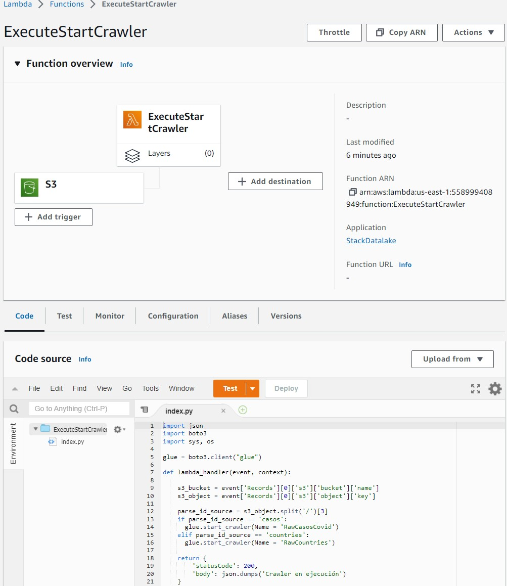

# Data-processing-COVID-cases-GLUE-AWS

En este proyecto se hara el procesamiento de datos por capas de casos de COVID por paises, se tiene archivos .csv de casos y countries que se ingestaran en la capa RAW de un bucket de S3 activando el trigger para ejecutar la funcion lambda y crear las tablas logicas "casos" y "countries" en Glue Data Catalog mediante los CRAWLER creados. Seguidamente mediante un JOB creado en Glue Studio se procedera a enviar las tablas de "casos" y "countries" a la capa STAGE en formato PARQUET, posteriormente con ATHENA se procedera a realizar transformaciones para crear un solo TABLON de las 2 tablas de las variables de interes llamado "casos_countries" y se enviara a la capa ANALYTICS para su posterior analisis, para la creacion de dashboards e identificar insights de valor.

## Arquitectura realizada

  

##  PROCEDIMIENTO

## Creacion de recursos con CLOUDFORMATION con la plantilla YAML

 - Se procede a crear los buckets para las capas RAW, STAGE, ANALYTICS, así como un 4to bucket para guardar los logs de Athena.
 - Se crea las bases de datos RAW,STAGE,ANALYTICS en GLUE
 - Se crea tambien el rol para que el Crawler de GLUE pueda tener acceso a los servicios
 - Tambien se le da permisos para invocar funciones lambda en el bucket raw donde se almacenará la informacion primero. Para transformar la informacion de formato .csv    a formato parquet.   Tambien se coloca el rol que necesita lambda para funcionar sobre GLUE y S3. 

  

- Se indica la funcion de lambda en formato zip, donde se encuentra el script en Python que permite ver los eventos o triggers en el bucket, si el archivo que se         ingeste en “casos” iniciará el crawler  RAWCasosCovid o si el archivo es ingestado en “countries” llamara al crawler RawCountries.
- Finalmente se crean los crawler y se define los permisos para que se pueda escribir en las capas RAW, STAGE y ANALYTICS

  

## EJECUCION
Se ejecuta la plantilla yaml

##  Crawlers creados

  

##  Buckets creados

  

##  Funcion Lambda creada

  

## Trigger de la funcion
Esta se activara cuando el archivo que se ingeste un archivo en la carpeta “casos” iniciará el crawler  RAWCasosCovid o si se ingesta un archivo en la carpeta “countries” llamara al crawler RawCountries.

  

##  Se realiza la Carga de CSV
Una vez ingestados los archivos csv se procede a activar el trigger y se ejecuta la funcion lambda y los crawler de GLUE

  

  

##  CREACION DE TABLAS LOGICAS
Al iniciarse los CRAWLERS analizan la metadata y el esquema de los archivos  para crear las tablas logicas "casos" y "countries" en GLUE en la ubicacion de la capa RAW en S3

  

## Creacion y Ejecucion de JOB en GLUE STUDIO
Se crea un JOB en Glue Studio para realizar la transformacion de los archivos .csv de la capa RAW a formato PARQUET y almacenarlos en el bucket de la capa STAGE en S3.

  

## Archivo PARQUET en la capa STAGE

  

## Ejecucion de CRAWLER STAGE
Este Crawler se ejecuta para poder analizar la metadata de los archivos PARQUET en la capa STAGE de S3 para luego crear las tablas logicas en el Data Catalog de Glue.

  

## Configuracion de ubicacion de LOGS en ATHENA
Se tiene que indicar el bucket donde ATHENA almacenará los logs por cada consulta

  

## Creacion de Queries en ATHENA
Se abre el servicio ATHENA donde see observa como Data Source el "DataCatalog de GLUE" y en bases de datos estan las 3 bases de datos para cada capa RAW, STAGE y ANALYTICS

  

Se procede a realizar una query en la capa STAGE de la tabla CASOS

  

## Creacion de tabla analitica en CAPA ANALYTICS

En ATHENA se realiza la creacion de un TABLON "casos_countries" en formato PARQUET que viene de la union (inner join) de las 2 tablas logicas "casos" y "countries" seleccionando las variables de interes, el cual se envia a la CAPA ANALYTICS para su consumo en la creacion de DASHBOARDS o de Modelos Predictivos.

  

## bucket de capa ANALYTICS
Se muestra la tabla "casos_countries" almacenada en formato PARQUET

  

## Query en la tabla "casos_countries"

  

